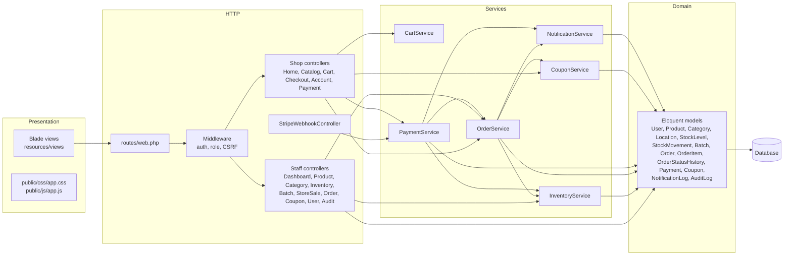

# 03 — UML Component Diagram

```mermaid
flowchart LR
    subgraph Presentation
        V[Blade views<br/>resources/views]
        CSS[public/css/app.css<br/>public/js/app.js]
    end
    subgraph HTTP
        R[routes/web.php]
        MW[Middleware<br/>auth, role, CSRF]
        SC[Shop controllers<br/>Home, Catalog, Cart, Checkout, Account, Payment]
        AC[Staff controllers<br/>Dashboard, Product, Category, Inventory,<br/>Batch, StoreSale, Order, Coupon, User, Audit]
        WH[StripeWebhookController]
    end
    subgraph Services
        INV[InventoryService]
        CART[CartService]
        COU[CouponService]
        ORD[OrderService]
        PAY[PaymentService]
        NOT[NotificationService]
    end
    subgraph Domain
        M[Eloquent models<br/>User, Product, Category, Location, StockLevel,<br/>StockMovement, Batch, Order, OrderItem,<br/>OrderStatusHistory, Payment, Coupon,<br/>NotificationLog, AuditLog]
    end
    DB[(Database)]

    V --> R --> MW --> SC & AC
    WH --> PAY
    SC --> CART & ORD & PAY & COU
    AC --> INV & ORD & M
    ORD --> INV & COU & NOT
    PAY --> ORD & INV & NOT
    INV & ORD & PAY & COU & NOT --> M --> DB
```
