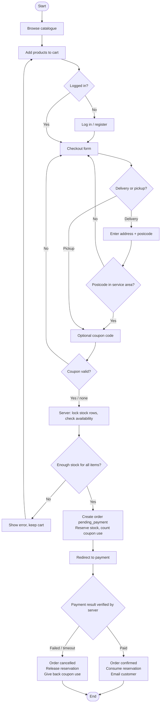

# 05 — Activity Diagram: Online ordering

```mermaid
flowchart TD
    A([Start]) --> B[Browse catalogue]
    B --> C[Add products to cart]
    C --> D{Logged in?}
    D -- No --> E[Log in / register] --> F
    D -- Yes --> F[Checkout form]
    F --> G{Delivery or pickup?}
    G -- Delivery --> H[Enter address + postcode]
    H --> I{Postcode in service area?}
    I -- No --> F
    I -- Yes --> J
    G -- Pickup --> J[Optional coupon code]
    J --> K{Coupon valid?}
    K -- No --> F
    K -- Yes / none --> L[Server: lock stock rows, check availability]
    L --> M{Enough stock for all items?}
    M -- No --> N[Show error, keep cart] --> C
    M -- Yes --> O[Create order pending_payment<br/>Reserve stock, count coupon use]
    O --> P[Redirect to payment]
    P --> Q{Payment result verified by server}
    Q -- Paid --> R[Order confirmed<br/>Consume reservation<br/>Email customer]
    Q -- Failed / timeout --> S[Order cancelled<br/>Release reservation<br/>Give back coupon use]
    R --> T([End])
    S --> T
```
