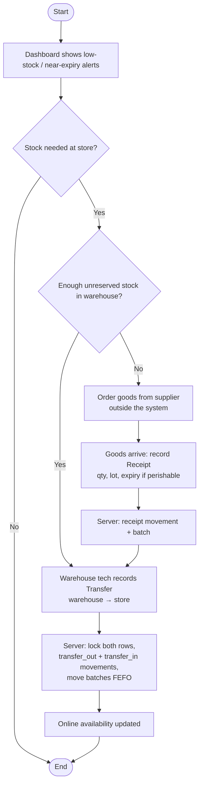

# 06 — Activity Diagram: Stock replenishment

```mermaid
flowchart TD
    A([Start]) --> B[Dashboard shows low-stock / near-expiry alerts]
    B --> C{Stock needed at store?}
    C -- No --> Z([End])
    C -- Yes --> D{Enough unreserved stock in warehouse?}
    D -- Yes --> E[Warehouse tech records Transfer<br/>warehouse → store]
    E --> F[Server: lock both rows,<br/>transfer_out + transfer_in movements,<br/>move batches FEFO]
    D -- No --> G[Order goods from supplier<br/>outside the system]
    G --> H[Goods arrive: record Receipt<br/>qty, lot, expiry if perishable]
    H --> I[Server: receipt movement + batch]
    I --> E
    F --> J[Online availability updated]
    J --> Z
```
